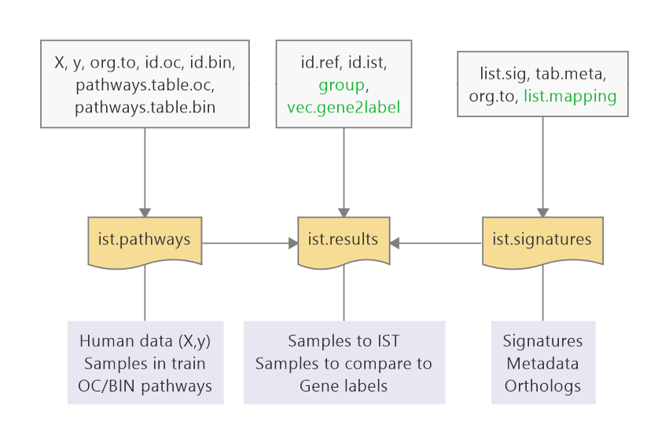

```{r setup, include=FALSE}
knitr::opts_chunk$set(
    echo = TRUE, message = FALSE, error = FALSE, 
    fig.width = 7, fig.height = 6)
```

# Getting started

## Libraries

```{r libs}
library(methods)
library(ggplot2)
library(pcaMethods)

library(magrittr)
library(plyr)
library(dplyr)

library(IST)

set.seed(1)

# orthology mappings
data("data.list.orth")
# gene labels
data("vec.ensembl2symbol")
```


## Example data

Load example data:

```{r}
data("sample.data.ist")
str(sample.data.ist, max.level = 1)
```

Briefly:

* `X.hsa`: molecular readouts in humans
* `y.hsa`: class in humans
* `fc.mmu.rnd`: random signatures for mouse
* `fc.mmu.true`: true signatures for mouse
* `path.hsa.oc`, `path.hsa.bin` hypothetical pathways to apply the 
one class and binary models
* `df.orth`: orthology mapping used to build the synthetic data
* `dt.fc.mmu`: data.table with many signatures
* `df.meta.mmu`: made-up metadata 

PCA of the human data:

```{r pca}
df.pca <- pca(sample.data.ist$X.hsa, scale = "uv", center = TRUE) %>% 
    scores %>%
    as.data.frame %>%
    dplyr::mutate(sample = rownames(.), class = gsub("\\d", "", sample))

ggplot(df.pca, aes(x = PC1, y = PC2, colour = class)) +
    geom_hline(yintercept = 0, lty = 2, colour = "gray50") +
    geom_vline(xintercept = 0, lty = 2, colour = "gray50") +
    geom_point() +
    theme_bw() +
    theme(aspect.ratio = 1)
```

All the genes are differential in this small dataset, 
pick 100 at random for demonstration purposes

```{r}
de.genes <- head(sample(colnames(sample.data.ist$X.hsa)), 100)
```

# Classical/legacy IST 

These classes are still being kept, but more efficient alternatives should be
available in the future. 
These will allow analysing more signatures at once.

## Translators

### Fit (orthology mapping)

This one is a bad translator (random fold changes)

```{r transbad}
ist.trans <- methods::new(
    "ist.translator", 
    animal.data.table = sample.data.ist$fc.mmu.rnd, 
    org.from = "mmusculus", 
    org.to = "hsapiens", 
    mapping.data.table = data.list.orth$mmusculus)

ist.trans <- fit(ist.trans)
```

A good one (true fold changes)

```{r transgood}
ist.trans <- methods::new(
    "ist.translator", 
    animal.data.table = sample.data.ist$fc.mmu.true, 
    org.from = "mmusculus", 
    org.to = "hsapiens", 
    mapping.data.table = data.list.orth$mmusculus)

ist.trans <- fit(ist.trans)
```

### Predict (in silico treat)

Just use `predict` on the data matrix (colnames automatically matched
against orthologs)

```{r transpredict}
X.new <- predict(ist.trans, newdata = sample.data.ist$X.hsa)
```

## Discriminators

### Defining sample groups

IST needs to know which samples are used to fit the models, 
to in silico treat and which samples look like the ideal output.

```{r}
# use all the samples to fit one-class and binary models
id.oc <- rep(TRUE, nrow(sample.data.ist$X.hsa))
id.bin <- rep(TRUE, nrow(sample.data.ist$X.hsa))

# in silico treat the controls
id.ist <- sample.data.ist$y.hsa == -1
# they should look like disease
id.ref <- sample.data.ist$y.hsa == 1
```


### IST flavours

#### Fit (one-class, binary)

Define the discriminator

```{r discr}
ist.discr <- define(
    "ist.discriminator",
    X = sample.data.ist$X, 
    y = sample.data.ist$y, 
    org.to = "hsapiens", 
    de.genes = de.genes, 
    id.oc = id.oc, 
    id.bin = id.bin, 
    id.ref = id.ref, 
    id.ist = id.ist)
```

Fit IST flavours:

* One-class (offsite/unwanted effects): `iss`
* Binary: `isd` (all disease genes), `isa` (only genes in animal signature)

```{r}
ist.discr <- fit(
    ist.discr, 
    flavour = c("isd", "isa"), 
    ist.translator = ist.trans, 
    ncomp = 10)
```

#### Predict

To get the decision values or pls scores, you can use the `predict()` function.
Here, we will predict on the treated and untreated (original) human data:

```{r}
# prediction: pls scores isd/isa
df.scores <- plyr::ldply(
    list(trt = X.new, untrt = sample.data.ist$X.hsa),
    predict, 
    object = ist.discr, 
    type = "scores",
    .id = "treatment")
```

Plot the desired magnitude. 
For instance, scores:

```{r}
ggplot(df.scores, aes(x = Comp1, 
                      y = Comp2, 
                      colour = gsub("\\d", "", sample))) +
    geom_hline(yintercept = 0, lty = 2, colour = "gray50") +
    geom_vline(xintercept = 0, lty = 2, colour = "gray50") +
    geom_point() +
    facet_grid(flavour~treatment) + 
    theme_bw() +
    theme(aspect.ratio = 1)
```

Scores with densities:

```{r}
ggplot(dplyr::filter(df.scores, treatment == "trt"), 
       aes(x = Comp1, 
           y = Comp2, 
           colour = gsub("\\d", "", sample))) +
    geom_hline(yintercept = 0, lty = 2, colour = "gray50") +
    geom_vline(xintercept = 0, lty = 2, colour = "gray50") +
    stat_density_2d(aes(x = Comp1, 
                        y = Comp2, 
                        colour = gsub("\\d", "", sample), 
                        fill = stat(level)), geom= "polygon", 
                    data = dplyr::filter(df.scores, treatment == "untrt")) +
    scale_fill_gradient(low = "gray90", high = "black") +
    geom_point(size = 1, pch = 19) +
    facet_grid(~flavour) + 
    theme_bw() +
    theme(aspect.ratio = 1)
```

#### Plot (includes predict)

Using `plot()` on a translator and a discriminator:

* Uses the translator to in silico transforms the original human data 
that is stored in the discriminator
* Uses the discriminator to predict on the original and in silico treated data
* Plots the desired output (scores/decision)

Scores (drawn as avocado plots)

```{r}
plot(ist.trans, ist.discr, type = "scores")
```

Decisions (drawn as boxplots)

```{r}
# Commented line, probably some legacy code error I cannot fix now
# plot(ist.trans, ist.discr, type = "decision")
```

Precict and plot the decision values now:

```{r}
# prediction: decision values (all flavours)
df.decision <- plyr::ldply(
    list(trt = X.new, untrt = sample.data.ist$X.hsa),
    predict, 
    object = ist.discr, 
    .id = "treatment")
```

```{r}
ggplot(df.decision, aes(x = gsub("\\d", "", sample), 
                        y = decision.value)) +
    geom_hline(yintercept = 0, lty = 2, colour = "gray50") +
    geom_boxplot() +
    facet_grid(flavour~treatment) + 
    theme_bw() +
    theme(aspect.ratio = 1)
```


# Classes under development

## Overview

The newest implementation relies on three classes, each one with a purpose:

* `ist.signatures`: store a collection of signatures
* `ist.pathways`: store oc/bin models for a collection of pathways
* `ist.results`: apply an `ist.signatures` object 
into the `ist.pathways` models and display the outcomes 
(boxplots, heatmaps)



Also, there are built-in data objects that can ease the process:

* `data.list.orth`: orthology mapppings from rat, mouse and human to human
* `vec.ensembl2symbol`: readable and unique gene labels in the genemaps

## Signature collections

To handle several datasets with a single object, 
the `ist.signatures` class stores signatures, 
metadata and orthology mappings, 
possibly with multiple species.

First, the data must accomodate the input format for the list of signature

```{r}
list.sig <- lapply(
    split(sample.data.ist$dt.fc.mmu, 
          sample.data.ist$dt.fc.mmu$sig.id), 
    function(dt) {
        tab <- as.data.frame(dt[, c("logFC", "adj.P.Val")])
        rownames(tab) <- dt$gene.id
        
        tab
    }
)

head(list.sig$Signature1)
```

And for the metadata, which must contain the columns `sig.id` 
(coincident with the names in the list of signatures), `sig.name` 
(still unused) and 
`sig.org` (organism, concordant with the names of the orthology mapping list)

```{r}
meta.sig <- mutate(
    sample.data.ist$df.meta.mmu, 
    sig.id = as.character(sig.id), 
    sig.org = as.character(sig.org), 
    sig.name = sig.id)

meta.sig
```

The orthology mapping must be ready, as provided in the precomputed data 
or as generated by `orthIDcon()`:

```{r}
list.orth <- data.list.orth["mmusculus"]

head(list.orth$mmusculus)
```

The `ist.signatures` object must be define and fitted.
Showing it will display a graphical summary of its contents.

```{r}
ist.sig <- define(
    "ist.signatures", 
    list.sig = list.sig, 
    tab.meta = meta.sig,
    org.to = "hsapiens",
    list.mapping = list.orth
) %>% fit

ist.sig
```

## Pathway models (includes oc/bin)

There is a dedicated class `ist.pathways` for 
pathway models (including one-class and
binary models).
It stores the pathways and the oc/bin models fitted on them.

For illustrative purposes, we are going to use the dummy pathways in the 
example data; they are not actually related with how the data was 
generated.

The fitting does not run in parallel at the moment; 
the code is ready but needs debugging.

```{r}
ist.path <- define(
    "ist.pathways",
    X = sample.data.ist$X, 
    y = sample.data.ist$y, 
    org.to = "hsapiens", 
    id.oc = id.oc, 
    id.bin = id.bin, 
    pathways.table.oc = sample.data.ist$path.hsa.oc %>% head(100), 
    pathways.table.bin = sample.data.ist$path.hsa.bin %>% head(100)
) %>% fit

ist.path
```

To predict on a specific dataset, the function `predict()` 
understands on pathway objects as well.
Data frame with scores:

```{r}
df.scores.path <- plyr::ldply(
    list(trt = X.new, untrt = sample.data.ist$X.hsa),
    predict, 
    object = ist.path, 
    type = "scores",
    .id = "treatment")
```

Data frame with predictions:

```{r}
df.decision.path <- plyr::ldply(
    list(trt = X.new, untrt = sample.data.ist$X.hsa),
    predict, 
    object = ist.path, 
    type = "decision",
    .id = "treatment")
```

The pathway is added as an extra column:

```{r}
head(df.decision.path)
```

However, to apply a battery of signatures, a single data.frame is not 
convenient enough: we therefore resort to an `ist.results` object.

## Results object

There is a convenient `ist.results` class that applies all the signatures in
`ist.signatures` and predicts per pathway on an `ist.pathways` object.
One also has to specify which samples to in silico treat (`id.ist`) and 
which reference group these should ideally resemple (`id.ref`).

```{r}
ist.res <- define(
    "ist.results", 
    ist.signatures = ist.sig, 
    ist.pathways = ist.path, 
    id.ref = id.ref, 
    id.ist = id.ist, 
    vec.gene2label = vec.ensembl2symbol
) %>% fit

ist.res
```

The `ist.results` contains data tables to reproduce boxplots and heatmaps
that display the recovery by pathway, keeping an eye on the reference human 
data without any transformation.

### Boxplots

By default plots the first 4 pathways, but the behaviour can be changed.
Aesthetics on the signature metadata are allowed using `mapping = aes()`
and rows can be facetted by using `facet_rows = vars()`

```{r}
plot.ist.boxplots(
    ist.res, 
    mapping = aes(fill = sig.attr1), 
    facet_rows = vars(sig.attr2))
```

The signatures can be subsetted as well, and the plotting function 
returns the plot object as well as the table to generate it.
The functions `getSignatures()` and `getPathways()` can be useful 
to select pathways from the results object.

```{r, fig.width=5, fig.height=3}
sig.id <- head(getSignatures(ist.res), 3)
path.id <- head(getPathways(ist.res), 3)
plot.ist.boxplots(
    ist.res, y = path.id, 
    sig.ids = sig.id, mapping = aes(fill = sig.attr2))
```

### Gene heatmaps

Gene heatmaps display the recovery of individual genes within a pathway.
Their sum is the total pathway recovery, as shown in the boxplots.
The user must specify which pathway to represent.
With the `type` argument, one can choose either ggplot or pheatmap plots.

```{r}
path.plot <- head(getPathways(ist.res), 1)
path.plot
plot.ist.genemaps(ist.res, y = path.plot)
```

Notice the gene labels, which are those specified in the original 
`vec.ensembl2symbol` object:

```{r}
head(vec.ensembl2symbol, 10)
```


The `pheatmatp` function can also be used, and will display the (scaled)
coefficients of the PLS models for every gene and signature metadata.
Note how not specifying `sig.ids` will just plot all the signatures.

```{r}
plot.ist.genemaps(
    ist.res, y = path.plot, type = "pheatmap", 
    vars.meta.sig = c("sig.attr1", "sig.attr3"))
```

The heatmaps can also be clustered by columns and by rows,
changing `args.pheatmap`:

```{r}
args.gmap <- list(cluster_rows = FALSE, cluster_cols = TRUE)

plot.ist.genemaps(
    ist.res, y = path.plot, type = "pheatmap", 
    vars.meta.sig = c("sig.attr1", "sig.attr3"), 
    args.pheatmap = args.gmap)
```

### Pathway heatmaps

Pathway heatmaps summarise the whole pathway recovery over signatures, 
providing the overall picture of IST.
These can also use `pheatmap`, subset pathways and signatures.

```{r}
plot.ist.pathwaymaps(ist.res)
```

Version with signature metadata and clustered rows and columns:

```{r, fig.width=5, fig.height=4}
args.pmap <- default.args.pheatmap("pathwaymap")
args.pmap$cluster_rows <- args.pmap$cluster_cols <- TRUE

plot.ist.pathwaymaps(
    ist.res, y = path.id, 
    sig.ids = sig.id, type = "pheatmap", 
    vars.meta.sig = c("sig.attr1", "sig.attr3"), 
    args.pheatmap = args.pmap)
```

### Pathway and signature prioritisers

The pathway heatmaps can be used to derive a ranking of the models.
Briefly, either the signatures or the pathways are sorted, according to
their mean recapitulation, but penalising the overshooting.
The function `rankPathwaymaps()` serves this purpose.

For instance, the ranking of all the signatures, using all the pathways:

```{r}
rankPathwaymaps(ist.res, what = "signatures", return.table = TRUE, max.out = 6)
```


The ranking of a subset of pathways, using a subset of signatures 
to evaluate them:

```{r}
rankPathwaymaps(
    ist.res, what = "pathways", id.path = path.id, 
    sig.ids = sig.id, return.table = TRUE)
```


# Reproducibility

```{r date}
date()
```

```{r rsession}
sessionInfo()
```

